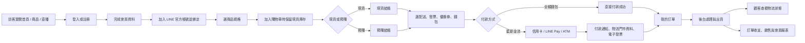
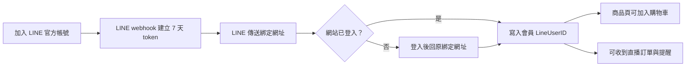
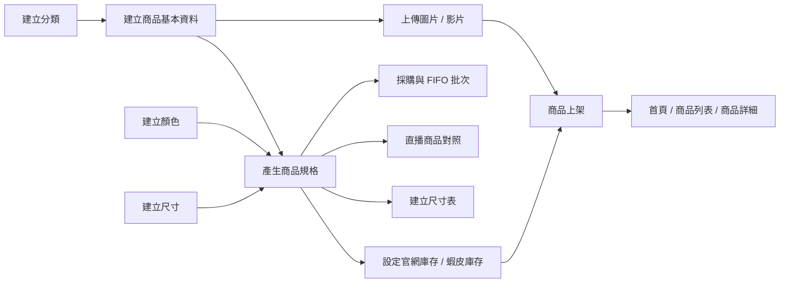
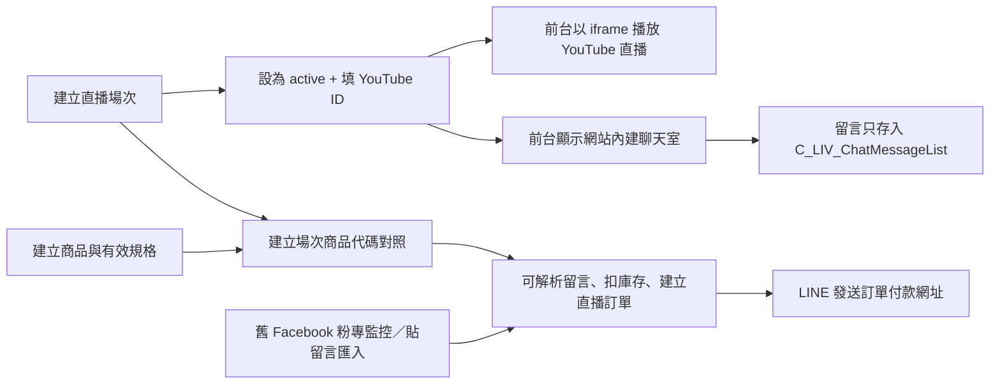
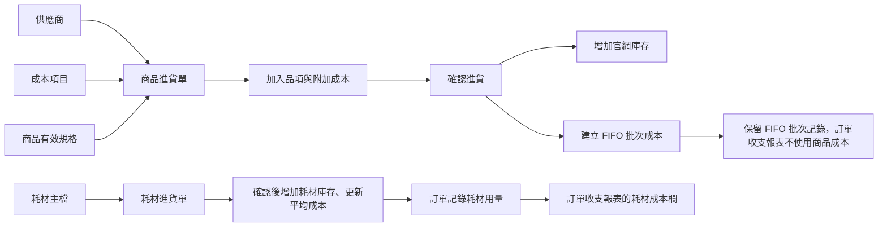

# Aley's Wardrobe 使用者網站地圖

> 盤點日期：2026-07-19
> 依據：目前 Vue 路由、所有前後台頁面、Pinia stores、Supabase Edge Functions、migrations 與 `database-schema.md`。
> 目的：讓顧客、營運與管理員知道每個功能的入口、前置資料，以及一項操作會影響哪些後續頁面。

## 先看懂這份地圖

網站有四種使用情境：

| 身分 | 能做的事 | 主要限制 |
|---|---|---|
| 訪客 | 看首頁、商品、直播與說明頁 | 不能收藏、加入購物車、結帳或留言 |
| 一般會員 | 管理帳號、收藏、購物車、訂單、錢包、優惠券、直播留言 | 加入購物車前還必須綁定 LINE |
| 啟用中的管理員 | 進入 `/admin`，依側欄權限管理營運功能 | 側欄會依 `CanManage*` 權限隱藏模組 |
| 超級管理員 | 擁有全部權限並可管理其他管理員 | `IsAdmin = true` |

圖例：

- 「前置」：沒有先建立或完成，就無法使用或頁面會沒有內容。
- 「影響」：在此頁修改資料後，會連動的其他頁面或報表。
- 「空畫面條件」：頁面可以打開，但因資料不足而不顯示主要內容。

## 全站主要使用流程



最重要的使用規則：

1. **已確認的產品規則：**瀏覽商品不需登入；收藏需登入；所有一般網購加入購物車都必須「登入 + LINE 已綁定」。商品一旦加入購物車，顧客不能自行取消。
2. 現貨在「加入購物車」時就扣官網庫存，不是結帳完成才扣。
3. 現貨與預購分開結帳，會形成不同訂單。
4. 結帳至少要有一個啟用中的配送方式，否則無法送單。
5. **已確認的產品規則：**每週一 00:00 直接處理全部待付款／付款失敗訂單及全部未結帳現貨購物車，不設逾期天數；流程會回補庫存並可能封鎖會員。
6. 直播正式展示方式已改為 YouTube 直播 iframe；前台聊天室是網站自己的留言資料，不是 YouTube 聊天留言。

---

## 前台網站地圖

### A. 公開瀏覽區

| 頁面 | 路徑 | 使用者看到什麼 | 前置／空畫面條件 | 會受哪些後台功能影響 |
|---|---|---|---|---|
| 首頁 | `/` | Hero、活動橫幅、最新 8 件商品、分類入口、品牌內容 | 沒 Banner 時顯示預設裝飾；沒商品時新品區為空 | Banner 管理、商品上架、網站參數 `announcement` |
| 商品列表 | `/products` | 上架商品、分類篩選、價格／最新排序、載入更多 | 只顯示 `IsActive = true`；沒分類時分類列空白；沒商品時顯示空狀態 | 分類管理、商品管理、圖片與價格 |
| 商品詳細 | `/products/:id` | 圖片／影片、顏色、尺寸、庫存、預購、尺寸表、收藏與加入購物車 | 商品需有啟用規格才能選；售完且未開預購不能加入；加入購物車需登入及 LINE 綁定 | 商品資料、顏色、尺寸、規格庫存、尺寸表、Storage |
| 直播 | `/live` | 最新一個「直播中」場次、YouTube 影片、即時聊天室 | 沒 active 場次顯示「目前沒有直播」；沒 `YtVideoId` 時影片顯示準備中；留言需登入 | 直播場次狀態、YouTube ID、聊天室 Realtime |
| 尺寸指南 | `/size-guide` | 靜態尺寸說明 | 無資料依賴 | 程式內固定內容 |
| 退換貨政策 | `/returns` | 靜態政策 | 無資料依賴 | 程式內固定內容 |
| 配送說明 | `/shipping` | 靜態配送說明 | 無資料依賴 | 程式內固定內容；不會自動同步配送方式設定 |
| 常見問題 | `/faq` | 靜態問答 | 無資料依賴 | 程式內固定內容 |
| 品牌故事 | `/brand-story` | 靜態品牌內容 | 無資料依賴 | 程式內固定內容 |
| 聯絡我們 | `/contact` | 靜態客服與社群資料 | 無資料依賴 | 程式內固定內容 |
| 隱私權政策 | `/privacy-policy` | 靜態隱私權內容 | 無資料依賴 | 程式內固定內容 |

### B. 帳號與會員區

| 頁面 | 路徑 | 使用者看到／能做什麼 | 前置／空畫面條件 | 影響 |
|---|---|---|---|---|
| 登入／註冊 | `/login` | Email 密碼登入、註冊、Facebook 登入、寄送重設密碼信 | Facebook 登入需 Supabase OAuth 設定 | 建立 Auth 使用者；後續建立會員資料 |
| OAuth 回呼 | `/auth/callback` | 自動處理 Facebook 登入並導頁 | Facebook 新會員會寫入 `FbName`；找預設會員等級 | `FbName` 是 Facebook 直播訂單比對依據 |
| 重設密碼 | `/reset-password` | 設定新密碼 | 必須從有效的重設信件進入 | 更新 Supabase Auth 密碼後登出 |
| 我的帳號 | `/account` | 姓名、電話、性別、生日、會員等級、最近 3 筆訂單、LINE 綁定狀態 | 需登入；沒會員紀錄時可用儲存資料建立 | 結帳預填姓名電話；直播以姓名／Facebook 名稱比對 |
| LINE 綁定回呼 | `/bind-line?token=...` | 使用一次性連結完成 LINE 與網站帳號綁定 | 需先加 LINE 好友取得 7 天有效 token；沒登入會先去登入 | 綁定後才能從商品頁加入購物車，也可收直播／待結通知 |
| 優惠券專區 | `/coupons` | 目前有效的自動與手動優惠券 | 需一般會員登入；管理員帳號會被導回首頁；無有效券時空白 | 優惠券管理的日期、啟用狀態與剩餘次數 |

LINE 綁定流程：



### C. 購物、付款與售後區

| 頁面 | 路徑 | 使用者看到／能做什麼 | 前置／空畫面條件 | 影響 |
|---|---|---|---|---|
| 願望清單 | `/wishlist` | 收藏中的上架商品，可移除或進入商品頁 | 需登入；收藏商品若已下架，不再顯示 | 商品上／下架、商品刪除、會員收藏資料 |
| 購物車 | `/cart` | 現貨與預購分區、調數量、移除、分別前往結帳 | 頁面路由公開，但實際會要求登入；空購物車顯示提示 | 現貨數量變動直接扣／補庫存；預購不應扣現貨庫存 |
| 結帳 | `/checkout?type=stock` 或 `?type=preorder` | 配送、收件人、發票、錢包、優惠券與金額明細 | 需登入；相對應類型購物車需有商品；至少一個啟用配送方式 | 建立訂單、訂單明細、錢包流水、優惠券剩餘次數、FIFO 成本 |
| 訂單成功 | `/order-success/:orderNo` | 訂單編號、查看訂單、繼續購物 | 需登入；主要是結果頁 | 觸發 GA `purchase`，不代表所有非同步付款都已完成 |
| 我的訂單 | `/orders` | 會員 Email 對應的全部訂單，顯示現貨／預購與付款狀態 | 需登入；沒訂單時顯示空狀態 | 網站訂單、付款通知、後台退款 |
| 訂單明細 | `/orders/:orderNo` | 訂單、商品、配送、超商門市、物流單號、ATM 資訊、重新付款 | 需登入且訂單 `CustomerEmail` 必須等於登入 Email | 付款通知、訂單狀態、後台出貨、物流回呼、退款 |
| 我的錢包 | `/wallet` | 餘額、最近 50 筆流水、儲值、ATM 待繳資料、發票選項 | 需登入；沒錢包資料顯示 0；儲值需藍新與 ezPay 設定 | 結帳可折抵、後台可調整、退款可退回錢包 |

結帳時的金額順序：

```text
商品小計
+ 配送費
- 手動優惠券
- 最符合門檻的自動優惠
= 最終金額（最低 1 元）
- 選用的錢包餘額
= 實際送到藍新的金額
```

注意：目前自動優惠的「最佳」是依最高消費門檻選擇，不是依最大折扣金額選擇；手動券與自動券可以同時折抵。

---

## 後台網站地圖

所有後台路由都先要求：已登入，且 `S_SYS_AdminUserList.IsActive = true`。

### A. 儀表板

| 頁面 | 路徑 | 資料前置 | 影響／用途 |
|---|---|---|---|
| 後台首頁 | `/admin` | 訂單與商品規格資料 | 顯示今日／本月訂單、營收、待付款、低庫存、最近訂單；連到訂單與庫存頁 |

### B. 商品管理



| 頁面 | 路徑 | 能做什麼 | 先建立什麼／沒有資料的結果 | 會影響 |
|---|---|---|---|---|
| 商品列表 | `/admin/products` | 搜尋、分類／上下架篩選、庫存摘要、進入新增或編輯 | 沒商品時清單空白 | 首頁、商品列表、願望清單、庫存、直播、報表 |
| 新增商品 | `/product/products/new` | 建立商品草稿並填基本資料 | 建議先有分類、顏色、尺寸 | 儲存後才有商品 ID，可上傳媒體與規格 |
| 編輯商品 | `/product/products/:id` | 基本資料、上下架、預購、直播代碼、圖片／影片、規格、官網／蝦皮庫存、尺寸表、刪除商品 | 無顏色或尺寸就無法形成可購買規格；無啟用規格時前台不能選款 | 幾乎所有商品、庫存、直播與報表頁 |
| 分類管理 | `/admin/products/setcategories` | 建立、編輯、刪除分類 | 商品表目前用分類名稱字串，不是分類 ID | 商品編輯下拉、商品列表篩選、前台分類篩選 |
| 標籤管理 | `/admin/products/settags` | 建立、編輯、啟用、刪除標籤 | 目前沒有頁面把標籤指派給商品 | 現階段對前台沒有可見影響 |
| 顏色管理 | `/admin/products/setcolors` | 建立、編輯、刪除顏色 | 被規格使用時刪除可能受 FK 限制 | 商品規格與前台顏色選擇 |
| 尺寸管理 | `/admin/products/setsizes` | 建立、編輯、排序、刪除尺寸 | 排序不可為 0；被規格或尺寸表使用時刪除可能受限 | 商品規格、前台尺寸順序與尺寸表 |

商品要在前台「可買」，至少需同時具備：

1. 商品 `IsActive = true`。
2. 至少一筆有效的顏色 × 尺寸規格。
3. 規格 `IsActive = true`。
4. 規格有現貨，或商品已啟用預購且該規格售完。
5. 顧客已登入並綁定 LINE，才可執行加入購物車。

圖片不是可買的硬性條件；沒有圖片時前台會出現預設空圖。尺寸表與商品標籤也不是購買必要條件。

### C. 訂單管理

| 頁面 | 路徑 | 能做什麼 | 資料前置 | 會影響 |
|---|---|---|---|---|
| 訂單列表／詳情 Modal | `/admin/orders` | 搜尋與篩選、改狀態、改收件資料、備註、查看狀態紀錄、記錄耗材與額外成本、出貨、退款、發票開立／作廢／折讓 | 需要訂單；狀態下拉依賴訂單狀態主檔 | 顧客訂單明細、物流、退款排行、訂單收支報表 |
| 待結清單 | `/admin/orders/pending` | 看未結帳現貨購物車、被銷單會員、發 LINE 提醒、手動觸發銷單 | 會員需有購物車；LINE 提醒需已綁定 | 庫存回補、訂單取消、購物車清除、會員封鎖 |
| 訂單狀態設定 | `/admin/orders/setstatus` | 建立、編輯、刪除狀態主檔 | 至少應有「待付款、待出貨、已出貨、完成、已退款」等流程狀態 | 新訂單預設狀態、付款成功狀態、後台狀態下拉、顧客狀態文字 |

訂單狀態的特別規則：

- 建單時取「ID 最小的第一個狀態」。
- 付款成功時取「ID 排序第二個狀態」。
- 出貨與退款則依狀態 `Name` 尋找 `shipped`、`refunded`。
- 因此狀態主檔不只是顯示文字，名稱與 ID 順序會改變流程行為。

### D. 直播管理



| 頁面 | 路徑 | 能做什麼 | 前置／空畫面條件 | 會影響 |
|---|---|---|---|---|
| 直播場次列表 | `/admin/live` | 建立場次，設定日期與 planned／active／closed | 無場次時前台直播頁沒有直播 | 前台 `/live` |
| 直播場次詳情 | `/admin/live/:id` | 編輯場次與 YouTube ID、建立商品代碼對照；頁面仍保留舊 Facebook 粉專連線、貼留言批次建單、起標／截標與每 8 秒輪詢入單 | YouTube iframe 只需場次 active 與影片 ID；舊自動入單仍需 Facebook 登入與粉專權限 | 直播前台、商品庫存、直播訂單、LINE 通知 |

直播顧客需要注意：

- 目前 YouTube 只負責播放；網站內建聊天室留言只會保存與即時顯示，**不會解析商品代碼，也不會自動建立購物車或訂單**。
- 舊 Facebook 批次匯入與自動監控程式仍在後台，並使用 Facebook 顯示名稱精確比對會員 `FbName`；它不是 YouTube 留言整合。
- 舊入單流程找不到會員、會員被封鎖或庫存不足時不會成功建單。
- LINE 未綁定不一定阻止舊後台建單，但使用者收不到付款連結。
- 前台目前沒有「預設配送地址」管理頁；直播訂單若資料庫也沒有預設地址，訂單地址可能是空白，需後台補齊。

### E. 庫存、採購與耗材



| 頁面 | 路徑 | 能做什麼 | 前置／空畫面條件 | 會影響 |
|---|---|---|---|---|
| 庫存總覽 | `/admin/inventory/overview` | 看上架商品各規格的官網／蝦皮庫存與低庫存 | 只列上架商品與啟用規格 | 商品可購買狀態、儀表板低庫存 |
| 庫存紀錄 | `/admin/inventory/logs` | 以最近 100 筆已付款訂單明細呈現出貨／銷售紀錄 | 沒已付款訂單時空白；不是完整的所有庫存異動帳 | 查詢銷售扣庫存來源 |
| 供應商 | `/admin/inventory/suppliers` | 建立與停用供應商 | 商品進貨單可不選，但供應商資訊會缺失 | 商品進貨單表頭 |
| 成本項目 | `/admin/inventory/setcosttypes` | 建立運費、關稅等附加成本類型 | 沒有成本項目時進貨單無法選附加成本 | FIFO 落地成本分攤 |
| 商品進貨單 | `/admin/inventory/purchases` | 建立草稿、看已確認進貨單 | 無商品有效規格時無法加入明細 | 進貨單詳情、總成本 |
| 商品進貨詳情 | `/admin/inventory/purchases/:id` | 表頭、收據、商品規格與附加成本；確認進貨 | 至少一筆品項才能確認；確認後不可再改；成本可填 0 | 增加官網庫存、建立 FIFO 批次；不影響訂單收支報表是否顯示 |
| 耗材主檔 | `/admin/inventory/consumables` | 建立包材／贈品／其他耗材 | 沒耗材時耗材進貨與訂單耗材都無選項 | 耗材進貨、訂單耗材成本 |
| 耗材進貨單 | `/admin/inventory/consumable-purchases` | 建立耗材進貨草稿 | 需先有啟用耗材 | 耗材進貨詳情 |
| 耗材進貨詳情 | `/admin/inventory/consumable-purchases/:id` | 加品項、收據、確認進貨 | 至少一筆品項；確認後不可修改 | 增加耗材庫存、重算加權平均成本 |

官網 `StockQty` 與蝦皮 `ShopeeStockQty` 是分開管理的；目前網站購物與直播只會動官網庫存。

### F. 財務與報表

| 頁面 | 路徑 | 主要內容 | 資料不足時 | 來源與上游 |
|---|---|---|---|---|
| 費用分類 | `/admin/finance/expense-categories` | 建立／啟用費用分類 | 無啟用分類時不能新增費用記錄 | 費用記錄；目前不併入訂單收支報表 |
| 費用記錄 | `/admin/finance/monthly-expenses` | 依月份記錄固定／營運費用，可附收據 | 無費用時當月為 0 | 獨立內部記錄；目前沒有店鋪淨利報表 |
| 銷售總覽 | `/admin/reports/sales` | 營收、訂單、客單、退款、低庫存、手續費、點擊、轉換、買家、Excel | 沒訂單／點擊時指標為 0 | 訂單、付款手續費、商品點擊、庫存 |
| 商品排行 | `/admin/reports/products` | 銷售額、數量、訂單數、買家、點擊與轉換率 | 需指定期間有已付款訂單 | 訂單明細、會員 ID、商品點擊 |
| 優惠券成效 | `/admin/reports/coupons` | 使用次數、折扣額、帶動營收、到期狀態 | 沒優惠券或訂單時為 0 | 優惠券主檔、訂單 `CouponCode` |
| 訂單狀態 | `/admin/reports/orders` | 依付款狀態顯示訂單分布 | 沒訂單時為 0 | 訂單付款狀態 |
| 會員成長 | `/admin/reports/members` | 12 個月新增會員、本月活躍、回購會員 | 沒會員／已付款訂單時為 0 | 會員、訂單 Email |
| GA 分析 | `/admin/reports/analytics` | GA4 狀態、事件說明、Looker Studio 嵌入 | 需環境變數 `VITE_GA_MEASUREMENT_ID`；嵌入需設定 `ga_looker_studio_url` | 商品瀏覽、加車、結帳、購買事件 |
| 訂單收支 | `/admin/reports/order-settlement` | 每張已付款訂單的商品售價、顧客運費、折價券、實收、金流手續費、實際物流、耗材、其他額外成本與淨收 | 商品成本為 0 不影響顯示；缺金流或物流成本時標示未記錄並暫以 0 計算 | 訂單金額、付款手續費、出貨實際運費、訂單耗材、額外成本 |
| 流量來源 | `/admin/reports/traffic` | 廣告／購物車／願望清單／直接來源點擊 | 需商品詳情點擊紀錄 | 商品詳情每日同裝置同商品去重 |
| 城市分析 | `/admin/reports/city-stats` | 已付款訂單按台灣縣市分組 | 地址空白會歸「未知」 | 訂單配送地址 |
| 退款排行 | `/admin/reports/refund-ranking` | 退款次數、金額、平均退款額 | 需退款狀態訂單 | 後台退款操作、顧客 Email／電話／姓名 |

已確認的報表規則：

1. 商品進貨成本可以全部填 0；使用者自行管理商品成本內帳，網站報表不讀取 FIFO、`UnitCost` 或 `LineCost`。
2. 報表以每張已付款訂單為底，列出商品售價、折價券、顧客支付運費、訂單實收、金流手續費、實際物流成本、耗材成本及其他額外成本，不顯示商品進貨成本。
3. 訂單淨收不可重複扣除折價券：若以 `FinalAmount` 為起點，折價券已經扣除；公式為 `FinalAmount − PaymentFee − ActualShippingCost − 耗材成本 − 其他額外成本`。
4. 若要從商品售價重新展開，公式為 `ItemsTotal + ShippingFee − DiscountAmount − PaymentFee − ActualShippingCost − 耗材成本 − 其他額外成本`。
5. 例如商品售價 800、折價券 50、金流 20、實際物流 60、耗材 6、無顧客運費收入與其他成本，訂單實收為 750，扣除後淨收為 664。

### G. 行銷、會員、錢包、設定與工具

| 模組／頁面 | 路徑 | 能做什麼 | 前置／影響 |
|---|---|---|---|
| 優惠券管理 | `/admin/marketing/setcoupons` | 建立手動碼／自動券、門檻、日期、啟用與剩餘次數 | 影響前台優惠券與結帳；名稱即手動優惠碼 |
| Banner 管理 | `/admin/marketing/setbanners` | 上傳圖片、排程、排序、連結、啟停 | `home-hero` 影響首頁右側；`home-banner` 影響首頁活動橫幅 |
| 會員列表 | `/admin/members` | 搜尋、改會員資料／Facebook 名稱／等級、管理購物車 | Facebook 名稱影響直播比對；移除購物車會回補庫存（經後台 API） |
| 會員等級 | `/admin/members/levels` | 名稱、順序、消費門檻、啟用 | 新會員預設取 `SortOrder` 最小；目前自動升等邏輯未見於頁面／函式 |
| 錢包管理 | `/admin/wallet` | 搜尋會員、看餘額與流水、手動增減 | 會員需先註冊；調整直接影響結帳可折抵金額 |
| 付款方式 | `/admin/settings/setpaymethods` | 維護付款方式主檔 | 目前前台實際付款選項由藍新參數控制，並不直接讀此主檔 |
| 配送方式 | `/admin/settings/setshippingmethods` | 維護名稱、代碼、運費、啟用 | 前台只讀啟用資料；`MethodCode` 必須用 `home` 或 `cvscom` 才能走既有分支 |
| 參數分類 | `/admin/settings/setconfigcategories` | 維護設定分類名稱 | 設定頁目前以文字保存 Category，沒有強制關聯 |
| 網站參數 | `/admin/settings/setconfig` | 維護 Key-Value | 實際使用的 key 見下一節 |
| 管理員帳號 | `/admin/settings/admin-users` | 從已註冊會員 Email 找 UserID，設定啟用、超管與五類權限 | 只有超級管理員可進；對方必須先在前台註冊 |
| PDF 裁切工具 | `/admin/tools/pdf-cropper` | 在瀏覽器選 PDF、框選／裁切並下載 | 不依賴資料庫，不會修改訂單或收據 |

目前程式實際讀取的網站參數：

| Key | 實際效果 |
|---|---|
| `announcement` | 前台頂端公告列；空值時隱藏 |
| `line_oa_url` | 前台 LINE 浮動按鈕連結；未設定時隱藏 |
| `shipping_cost_home` | 宅配出貨時，每箱實際成本 |
| `shipping_cost_cvscom` | 超商每箱成本；目前後台「標記出貨」只用於宅配分支 |
| `ga_looker_studio_url` | GA 報表嵌入網址 |
| `maintenance_mode` | Store 有讀取，但目前沒有任何頁面套用維護模式 |
| `payment_disabled` | Store 有讀取，但目前沒有阻止結帳或付款 |

---

## 「沒有先建立資料，哪裡會看不到東西」速查表

| 尚未建立／完成 | 直接結果 | 連帶影響 |
|---|---|---|
| 商品分類 | 商品編輯分類選項為空、前台分類篩選空 | 導覽列固定的 `tops`／`bottoms`／`dress` query 也可能篩不到商品 |
| 顏色或尺寸 | 無法建立完整商品規格 | 商品詳情無法選款，無法加入購物車；直播與採購也無規格可選 |
| 商品規格 | 商品雖可上架，但詳情頁沒有可選顏色／尺寸 | 無法購買、進貨或建立直播對照 |
| 商品圖片 | 商品仍可顯示與購買 | 首頁、列表、願望清單、購物車顯示空圖 |
| 商品庫存 | 售完且未開預購時不可買 | 庫存總覽顯示缺貨；直播搶標失敗 |
| 預購開關 | 庫存 0 時只顯示售完 | 開啟後庫存 0 才進預購流程 |
| 會員等級 | 新會員仍可建立，但等級可能空白 | 帳號頁沒有等級；會員報表仍可統計 |
| LINE 綁定 | 商品可以瀏覽與收藏，但商品頁不能加入購物車 | 收不到直播訂單、待結提醒 |
| 啟用配送方式 | 結帳頁顯示「目前沒有可用配送方式」且不能送單 | 網站訂單無法建立；直播批次建單可能用 0 元／空配送 ID |
| 有效優惠券 | 優惠券專區空白、結帳沒有自動優惠 | 優惠券報表只有主檔或全為 0 |
| 首頁 Banner | 首頁使用預設 Hero，活動橫幅不顯示 | 不影響商品購買 |
| active 直播場次 | `/live` 顯示目前沒有直播 | 聊天室與影片都不載入 |
| 直播 YouTube ID | 場次可 active，但影片顯示準備中 | 聊天室仍可使用 |
| 直播商品對照 | 無法解析／監控商品留言 | 不會建立直播訂單 |
| 會員 Facebook 名稱 | Facebook 留言找不到會員 | 不建直播訂單 |
| 會員預設地址 | 目前前台無法建立 | 直播批次訂單地址可能空白，後台需補 |
| 錢包資料 | 餘額顯示 0 | 仍可儲值；付款成功後建立錢包與流水 |
| 訂單狀態主檔 | 新訂單狀態可能為空，後台無狀態可選 | 顧客看不到業務狀態，出貨／退款自動狀態無法設定 |
| 供應商／成本項目 | 進貨單表頭或附加成本無選項 | 不影響零成本進貨；僅影響網站內商品成本紀錄 |
| FIFO 進貨批次 | 無法對應庫存批次 | 商品成本可為 0，但仍需批次數量供庫存流程使用 |
| 耗材主檔與進貨 | 訂單無耗材成本可記 | 訂單收支報表會少算耗材成本 |
| 費用分類 | 無法新增費用記錄 | 不影響訂單收支報表 |
| GA Measurement ID | 不送 GA 事件 | GA 報表只能看到未設定提示 |
| Looker Studio URL | GA 頁不顯示嵌入報表 | GA 事件仍可送出 |

---

## 功能互相影響總表

| 修改來源 | 會受影響的功能 |
|---|---|
| 商品上／下架 | 首頁新品、商品列表、願望清單、採購商品選擇、直播商品選擇 |
| 商品規格或顏色／尺寸 | 商品詳情、購物車顯示、庫存、直播對照、進貨 FIFO、訂單成本 |
| 官網庫存 | 商品可購買、購物車數量、直播搶標、低庫存報表 |
| 蝦皮庫存 | 只在商品編輯與庫存總覽顯示，現有網站訂單不會動它 |
| 加入／調整現貨購物車 | 立即改官網庫存、待結清單與每週銷單 |
| 確認商品進貨 | 增加官網庫存、建立 FIFO 批次；成本允許為 0，不得因此排除後續訂單報表 |
| 確認耗材進貨 | 增加耗材庫存、更新耗材平均成本 |
| 訂單耗材／額外成本 | 訂單收支明細與淨收，不包含商品進貨成本 |
| 出貨與箱數 | 顧客物流資訊、訂單狀態、實際運費成本、訂單淨收 |
| 退款 | 顧客付款狀態、退款排行與銷售報表；錢包退款另走錢包函式 |
| 優惠券 | 優惠券專區、結帳折扣、訂單折扣與優惠券成效 |
| 會員 Facebook 名稱 | 直播留言是否能建立訂單 |
| 會員 LINE 綁定 | 是否能前台加車、是否收到直播與待結通知 |
| 會員封鎖 | 直播建單會拒絕；一般網站結帳目前未檢查 `IsBlocked` |
| 每月費用 | 獨立記錄，不影響單張訂單收支報表 |

---

## 程式檢閱後需優先確認的落差

以下不是使用者操作說明，而是目前程式與文件／流程間可能造成實際結果錯誤的地方。

### P0／會直接造成資料或流程錯誤

1. **後端建單信任前端傳入的商品金額與明細。** `create-payment` 沒有重新查商品價格、規格與購物車歸屬，登入者可竄改 request 的 `amount`、`unitPrice` 或 `items`，屬於付款金額完整性風險。
2. **「加車後不能取消」尚未完整落實。** 現貨購物車畫面已鎖住數量與移除，但預購品仍可減少數量及直接刪除；而且 LINE 綁定只在商品詳情頁的畫面層檢查，`cart.addItem()` 與後端／資料庫沒有再次驗證，可被繞過。另 `cart.removeItem()` 若被用於現貨會直接刪資料而不回補庫存。
3. **混合錢包付款的退款流程不完整。** 訂單頁只呼叫 `refund-payment`，未串現有的 `wallet-refund`；信用卡 API 又使用整張訂單 `FinalAmount`，而不是實際藍新收款 `NewebpayAmt`。可能造成藍新退款金額錯誤，且錢包扣款未退回。
4. **重新付款會再次檢查已被購物車預留後的剩餘庫存。** 現貨在加車時已扣庫存，建單後仍維持扣除；`retry-payment` 再用目前 `StockQty >= 訂購數量` 判斷，最後幾件商品可能被誤判為庫存不足。
5. **錢包待繳 ATM 查詢仍使用舊欄位 `MemberID`。** Schema 與 migration 已改為 `UserID`，因此 `/wallet` 的 ATM 待繳清單可能載入失敗或永遠為空。
6. **預購出貨扣庫存 RPC 參數名錯誤。** 後台出貨使用 `p_id`，資料庫函式需要 `p_variant_id`；而 FIFO 已在前一步先扣，可能形成部分成功。
7. **Facebook 即時直播建立的訂單沒有完整顧客 Email／姓名／配送欄位。** 前台訂單列表與詳情用 `CustomerEmail` 判斷歸屬，因此 LINE 付款連結可能開不到該訂單。
8. **前台直播聊天室 Realtime schema 寫死為 `staging`。** 正式環境使用 `public` 時，初始留言可讀，但新留言可能不會即時出現。
9. **YouTube 直播尚未接上自動入單。** 前台 iframe 與網站聊天室可運作，但留言不會解析商品代碼；後台每 8 秒監控與批次匯入仍是 Facebook Graph API 流程。若正式流程需要留言自動建單，目前功能不成立。
10. **舊直播批次匯入建單失敗時可能吃掉庫存。** 流程先扣庫存再建立訂單；訂單 insert 失敗時只回報「請手動調整」，沒有自動回補，會讓庫存與實際數量不一致。

### P1／權限或營運規則風險

1. **後台側欄權限與路由權限不一致。** 商品、訂單、報表、行銷、設定，以及庫存總覽／紀錄多數只有側欄隱藏，路由沒有 `permission` meta；任何啟用中的管理員若直接輸入網址，可能仍能進入。
2. **狀態流程依賴資料列 ID 順序。** 付款成功不是依 `Name` 找待出貨，而是直接取第二筆狀態；重新排序或重建主檔可能導到錯誤狀態。
3. **未上架商品仍可用已知 ID 直接開詳情。** 商品詳情查詢沒有檢查 `IsActive`。
4. **`maintenance_mode` 與 `payment_disabled` 目前沒有實際作用。** 即使後台設為 true，也不會顯示維護頁或停用付款。
5. **優惠券次數在建立訂單時就扣除。** 付款失敗、訂單取消或退款都沒有回補 `UsageCount`，可能讓未完成付款占用券量。
6. **一般訂單成功頁不驗證付款狀態就送出 GA `purchase`。** ATM 取號等尚未付款的訂單也會計為購買，轉換與營收事件可能偏高。
7. **管理員功能的前端權限、Edge Function 權限與 RLS 不完全一致。** 例如側欄允許 `CanManageOrders`，但退款函式要求 `IsAdmin = true`；部分直接資料庫更新也可能被只允許超管的 RLS 擋下。

### P1／報表可能顯示錯誤

1. **後台首頁的今日訂單、待付款與低庫存固定容易顯示 0。** 查詢用了 `head: true`，但頁面讀 `data.length`，沒有讀回傳的 `count`。
2. **銷售總覽的低庫存與商品點擊也沒有正確讀 `count`。** 因此低庫存、點擊與轉換率指標可能永遠是 0／空白。
3. **優惠券成效查詢 `C_ORD_OrderList.CouponCode`，但目前 schema 與建單流程只保存 `CouponID`。** 報表可能查詢錯誤或永遠沒有使用資料。
4. **網站建單沒有寫入訂單 `MemberID`。** 銷售總覽的買家數、商品排行的不重複會員數會低估；目前 schema 文件也未列出 OrderList 的 `MemberID`，需一併確認實際部署欄位。

### P2／文件與資料品質落差

1. 程式使用 `C_CART_CartItemList.IsPreOrderItem`，但 `database-schema.md` 未列此欄位。
2. 會員等級頁使用 `MinSpendingAmount`，會員編輯使用 `LevelUpdatedAt`，但目前 schema 文件未完整列出。
3. `database-schema.md` 對 `fifo_deduct_batch()` 回傳值同時出現「總成本」與「加權平均單價」兩種說法，需以實際部署函式為準。
4. 付款方式主檔、設定分類、商品標籤目前有管理頁，但與前台核心流程的連接不完整。
5. 資料庫已有會員地址、商品評論、到貨通知、社群帳號、優惠券使用紀錄與商品歷史表，但目前沒有對應的可操作頁面或完整流程。
6. Router 沒有 404 fallback；不存在的網址沒有專用找不到頁面。

---

## 建議的首次開站建立順序

1. 建立至少一位超級管理員，再依工作分工建立管理員權限。
2. 建立訂單狀態主檔，先確認第一筆／第二筆與 `shipped`、`refunded` 的命名規則。
3. 建立配送方式：至少 `home` 或 `cvscom` 一筆啟用資料。
4. 建立網站參數：`line_oa_url`、運費成本、GA／Looker（如使用）。
5. 建立會員等級，確保最低 `SortOrder` 是新會員預設等級。
6. 建立商品分類、顏色、尺寸。
7. 建立商品、圖片／影片、有效規格、預購設定，先不要上架。
8. 建立供應商並開商品進貨單確認，產生庫存與 FIFO 批次；商品成本可依產品規則填 0。
9. 檢查前台商品詳情可正確選規格，再上架商品。
10. 建立優惠券與首頁 Banner。
11. 建立耗材、耗材進貨與費用分類。
12. 若要直播：先建立場次、填入 YouTube 影片 ID 並設為 active，再確認 LINE OA 與會員 LINE 綁定；若還要留言自動入單，需先決定以 YouTube 留言或網站聊天室為來源並完成新整合。
13. 用測試會員完整走一次：註冊 → LINE 綁定 → 加車 → 現貨／預購結帳 → 付款 → 發票 → 後台出貨 → 顧客看物流 → 報表核對。

## 尚待產品規則確認

1. 會員被封鎖後，目前只有舊直播建單會拒絕；一般網購是否也要禁止加車／結帳？
2. 自動優惠券要以「最高門檻」還是「折扣金額最高」作為最佳券？手動券是否允許與自動券疊加？
3. YouTube 正式流程是否需要「留言自動建單」？若需要，要讀取 YouTube 聊天留言，還是以網站內建聊天室留言為準？
4. 舊 Facebook 自動監控與貼留言批次匯入是否可以移除？
5. 直播訂單預設要宅配、超商，或讓會員先到網站補配送資料再付款？
6. 付款方式主檔是否要真正控制前台藍新付款選項？
